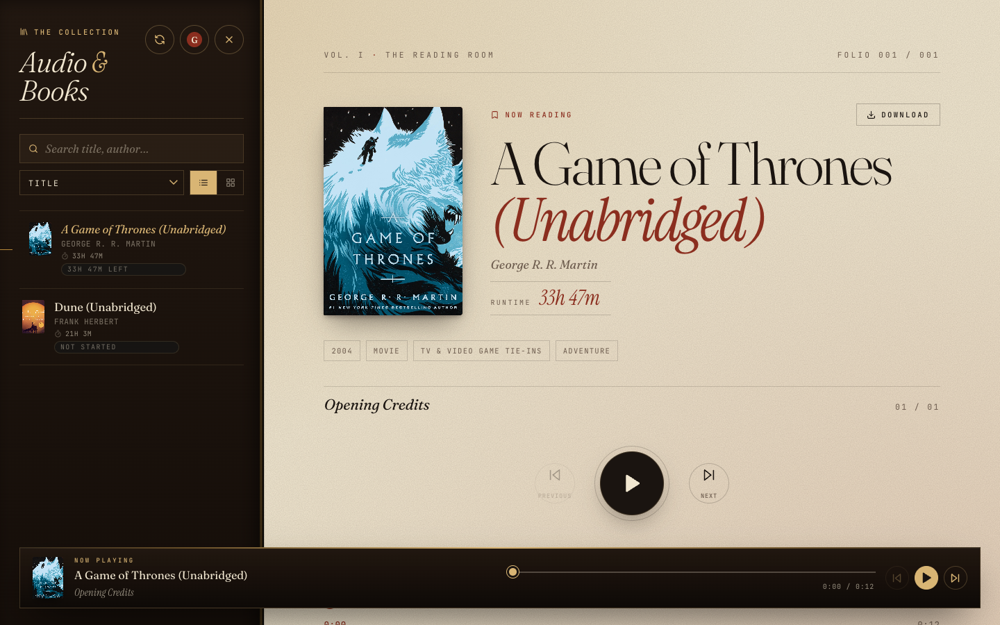
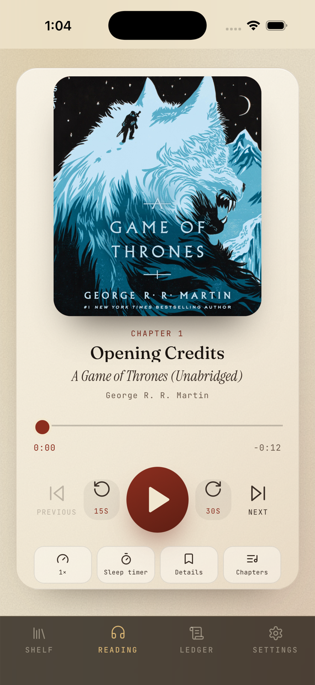

# OperaLibre

A private audiobook streaming app with a Rust media server and native Android and iOS frontends. The current build scans a folder of audiobook files, streams tracks with HTTP range requests, and saves playback progress.

OperaLibre is also designed to work as a headless audiobook server. The included React/Vite web app is the reference frontend, but the Rust server exposes an HTTP API that other web, mobile, desktop, or native clients can build against.

If you just want to use it, start with the plain-language [release installation guide](docs/installing-a-release.md), then see [Using OperaLibre](docs/using-operalibre.md) for phones, reader accounts, uploads, readalong, Jellyfin, and optional Audible imports.

## Download

The [GitHub releases page](https://github.com/DonovanMontoya/OperaLibre/releases) provides:

- **Combined packages** — the easiest option, with a background launcher that starts the server and opens the web app without keeping a Terminal window open
- **Server packages** — native server binaries for separate or headless deployments
- **Frontend package** — static web files for an existing OperaLibre or Jellyfin server
- **Update packages** — platform-specific, digest-verified bundles consumed by the combined package's Administration screen

Release builds are provided for Windows x64, Linux x64 and ARM64, and Intel and Apple Silicon Macs. Combined installations notify administrators about new versions; owners can install verified updates from the app. Each user-facing archive includes a `START-HERE.txt` guide.

For step-by-step installation, first launch, adding books, phone access, backups, and updates, see [Install a Release](docs/installing-a-release.md).

## See it in action

<p align="center">
  
  
</p>

The same library and playback experience runs in the browser and in the native Android and iPhone apps.

## License

This project is source-available for personal and noncommercial use under the [PolyForm Noncommercial License 1.0.0](LICENSE.md).

Commercial use, resale, paid hosting, or inclusion in a paid product requires a separate commercial license from the copyright holder.

## What is included

- Library scanning for `.mp3`, `.m4b`, `.m4a`, `.aac`, `.flac`, `.ogg`, `.opus`, `.wav`, and `.aiff`.
- Long-file streaming with byte-range support for seeking.
- Book and track browsing.
- Embedded cover art extraction and `/api/books/:bookId/cover` serving.
- Rich tag extraction for album/title, subtitle, author, narrator, publisher, dates, genres, language, description, and raw tag fields.
- Chapter extraction from M4A/M4B/MP4 chapter tracks or chapter lists, MP3 ID3 `CHAP` frames, and multi-file track boundaries.
- Readalong file detection and inline reading for `.epub`, `.pdf`, `.txt`, `.html`, and `.htm` companion files stored beside an audiobook.
- Sentence-level readalong sync for EPUB companions: the reader highlights the sentence being narrated, follows page and chapter changes, and seeks the audio when a sentence is clicked. Sync maps come from `.sync.json` sidecars or are generated server-side with an optional [echogarden](https://github.com/echogarden-project/echogarden) install.
- Playback position sync.
- Playback speed controls.
- 15-second rewind and 30-second forward controls.
- Sleep timer.
- Library search and sorting.
- Per-user listening profiles, streaks, and recent-book statistics.
- On-device audiobook downloads and offline playback in the native mobile apps.
- Media Session integration for OS-level playback controls where supported.
- PWA manifest plus Capacitor Android and iPhone apps that reuse the web frontend.
- A self-contained on-device demo that works without a server, account, or network connection.

## Build and run locally

You need Node.js 20+, Rust, and an audiobook folder. On macOS, run `xcode-select --install` once if you do not already have Apple’s command-line developer tools.

```bash
npm install
cp server.config.example server.config
```

Before starting, edit `server.config` and set `library_root` to the full path of the folder containing your audiobook files. Then run:

```bash
npm run dev
```

Open [http://localhost:5173](http://localhost:5173), make the first administrator account, and pick a book.

For a home setup that runs from one address after building, run `npm run build`, set `web_dist_dir = apps/web/dist` in `server.config`, then start `./apps/server/target/release/operalibre-server` and open [http://localhost:4000](http://localhost:4000). [Deployment](docs/deployment.md) explains how to keep it running after a restart.

On another device on your network, use your computer's LAN IP and make sure the server is allowed through the firewall. Install the web app from the mobile browser or use one of the included native mobile apps; step-by-step instructions are in [Using OperaLibre](docs/using-operalibre.md#use-it-on-a-phone-or-tablet).

The backend is a Rust `axum` service in `apps/server`. The frontend is a React/Vite app in `apps/web`.

## macOS app

The macOS app is a lightweight AppKit/WebKit host for the same React frontend. Build and launch it with:

```bash
./script/build_and_run.sh
```

The script builds the web frontend and Swift executable, stages `dist/OperaLibre.app`, and launches the app. Start the audiobook server separately with `npm run dev:server`; the app's first screen asks for its URL and remembers the server and sign-in token between launches. Plain HTTP is supported for local-network servers; use HTTPS for remote hostnames.

Use `./script/build_and_run.sh --verify` to build, launch, and confirm the app process started. The script also supports `--debug`, `--logs`, and `--telemetry`.

## iOS app

The iOS app is currently Testflight Only. Please enroll here: https://testflight.apple.com/join/x69Ffa33

### Jellyfin servers

Choose **Jellyfin** on the **Find your library** screen to connect with a normal Jellyfin user account. The default local address is `http://localhost:8096`. Jellyfin's configurable HTTPS port is `8920`, but HTTPS is disabled by default; remote servers should normally use a trusted HTTPS reverse proxy. See the [Jellyfin networking documentation](https://jellyfin.org/docs/general/post-install/networking/).

The client supports Jellyfin audiobook listing, multi-file album grouping, cover art, direct audio streaming, and resume-position synchronization. OperaLibre-specific features such as Libation, reader administration, metadata editing, readalong files, and the reader ledger are hidden while connected to Jellyfin.

## Android app

The Android app uses Capacitor 8 to package the same React frontend in a native Android 7+ project. With Android Studio, the Android SDK, and JDK 21 installed, build a debug APK from the repository root with:

```bash
npm run build:android
```

The APK is written to `apps/web/android/app/build/outputs/apk/debug/app-debug.apk`. To configure signing, run on an emulator or phone, or create a Play Store bundle, use `npm run android:open -w @operalibre/web` and finish the build in Android Studio.

The app supports plain HTTP for local-network and private-overlay OperaLibre or Jellyfin servers. Use HTTPS for public remote servers.

## iPhone app

The iPhone app uses Capacitor 8 to package the same React frontend in a native iOS 15+ Xcode project. Build the simulator app from the repository root with:

```bash
npm run build:ios
```

This rebuilds the frontend, synchronizes it into `apps/web/ios`, and produces an unsigned simulator build under `dist/ios-derived`. To configure signing and run on a physical iPhone, use `npm run ios:open -w @operalibre/web`, select your development team in Xcode, and choose the connected phone.

The app can connect over plain HTTP to local-network and private-overlay addresses, including Tailscale `100.x` addresses, for OperaLibre or Jellyfin servers. Use HTTPS for public remote servers. Its iOS audio session is configured for spoken-audio background playback so an active audiobook can continue while the app is backgrounded or the screen is locked.

## Custom frontends

The server owns library scanning, authentication, metadata extraction, cover art, readalong files, progress sync, downloads, and byte-range audio streaming. Frontends can treat it as a standalone API/media server and implement their own browsing, playback, and device UX.

- Use `POST /api/auth/login` to obtain a session token.
- Send the token as `Authorization: Bearer ...` for JSON API requests.
- Add the token as `?token=...` for media URLs used directly by `<audio>`, ``, or download links.
- Stream audio from the `streamUrl` returned by book detail responses; the server supports HTTP range requests for seeking.
- See [docs/api.md](docs/api.md) for the current endpoint list and response conventions.

For production deployments, the simplest setup is single-origin: build the web app with `npm run build` and set `web_dist_dir = apps/web/dist` in `server.config` so the Rust server serves both the frontend and the API (a reverse proxy works too). If they are served from different origins, set `allowed_origins` in `server.config` to the frontend origins before exposing the server outside a trusted network; when it is unset, the server reflects any requesting origin.

### Development tools

This project uses [Jujutsu](https://jujutsu-vcs.github.io/) (`jj`) for version control, with [JJ-VSC](https://github.com/jujutsu-vcs/jj-vsc) as the recommended VS Code integration. Clone with `jj` so the workspace is ready for that workflow:

```bash
jj git clone https://github.com/DonovanMontoya/OperaLibre.git
```

## Server config

The server reads `server.config` from the repo root by default. It is a plain `key = value` file:

```config
host = 0.0.0.0
port = 4000
library_root = /path/to/your/audiobooks
data_dir = data
progress_file = data/progress.json

libation_cli_path =
libation_files_dir =
alignment_cli_path =
```

Relative paths are resolved from the directory containing `server.config`. To use a different config file, set `OPERALIBRE_SERVER_CONFIG=/path/to/server.config` when starting the server.

## Library layout

Each folder is treated as one book:

```text
/Audiobooks
  /Book One
    01 Opening.mp3
    02 Chapter 1.mp3
    Book One.pdf
  /Book Two.m4b
  /Book Two.epub
```

A single audio file directly in the root is treated as its own book.

For readalong mode, place a supported companion file next to the audiobook. Folder-based books use a same-name file when present and otherwise use the first supported document in that book folder. Single-file books in the library root require a same-stem companion file, such as `Book Two.m4b` and `Book Two.epub`.

For sentence-level readalong sync, a book with an EPUB companion can also have a `.sync.json` sync map (same stem rules, e.g. `Book Two.sync.json`) mapping audiobook timestamps to EPUB sentences. Administrators can generate one from the readalong pane when [echogarden](https://github.com/echogarden-project/echogarden) is installed (`npm install -g echogarden`, or set `alignment_cli_path`); generated maps are written to `data_dir/sync/`. See [docs/library-layout.md](docs/library-layout.md) for details.

## Optional Libation / Audible import

The server can use a local Libation CLI installation as an optional acquisition tool. Libation must already be installed and authenticated on the server. The web app can then show Libation's Audible library, run a Libation scan, trigger liberation for a selected ASIN, and rescan the local audiobook folder after the download completes.

Set these in `server.config` only if you want the integration:

```config
libation_cli_path = /path/to/libationcli
libation_files_dir = /path/to/LibationFiles
```

If `libation_cli_path` is omitted, the server looks for `libationcli`, `LibationCli`, or `libationcli.exe` on `PATH`. `libation_files_dir` should point at the Libation files directory containing `AccountsSettings.json` and `Settings.json`; the web app reports when configured accounts are no longer authenticated.

## Android and iOS development

The checked-in Android Studio and Xcode projects live in `apps/web/android` and `apps/web/ios`. After changing the React frontend, run `npm run sync:android` or `npm run sync:ios` before building so the native bundle receives the latest web assets.

## Users

The server requires sign-in before any audiobook data is exposed. The first browser to load the app sees a one-time setup form that creates the initial administrator account; from then on the home screen is a sign-in form.

- Accounts are stored in `data/users.json` (configurable via `users_file`). Passwords are hashed with Argon2.
- Playback progress is tracked per user, so each reader has their own bookmarks.
- Administrators can add or remove readers, and reset any password, from the **Manage readers** menu under the avatar in the library pane.
- Sessions are stored in `data/sessions.json` and survive server restarts. They expire after 30 days, matching the session cookie lifetime.
- Streaming, cover art, and zip download requests carry the session token as a query parameter so plain `<audio>`/`` elements stay authenticated.

## Next build slices

- Bookmarks, clips, notes, and listening history.
- Word-level readalong sync (sentence-level sync shipped; the sync map format has room for word granularity).
- Queue and collections.
