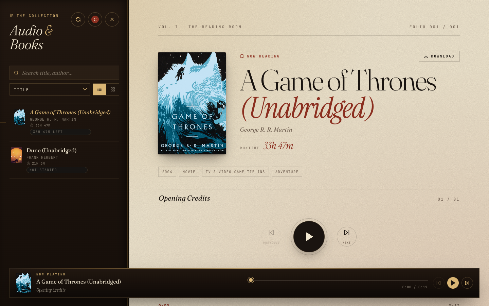
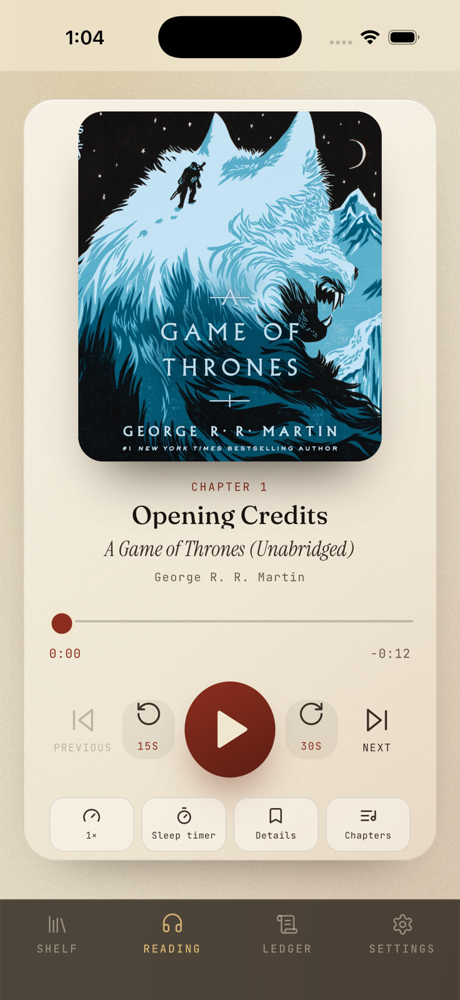

# OperaLibre

A private, self-hosted audiobook server with web, iPhone, Android, and macOS apps. Point it at a folder of audiobook files and stream them to any of your devices, with per-reader accounts, synced progress, and offline downloads.

The backend is a Rust `axum` server that exposes a documented HTTP API; the included React web app is the reference frontend, and other web, mobile, or desktop clients can build against the same server.

<p align="center">
  
  
</p>

## Features

- **Your files, your library.** Scans a folder of `.mp3`, `.m4b`, `.m4a`, `.mp4`, `.aac`, `.flac`, `.ogg`, `.opus`, `.wav`, and `.aiff` files with rich tag, chapter, and cover-art extraction.
- **A full player.** Seekable streaming, playback speed, sleep timer, 15/30-second skips, and OS-level media controls.
- **Per-reader accounts.** Each reader gets their own progress, listening stats, reading log, and a durable completion history that survives a book being deleted or replaced.
- **Readalong.** Read an EPUB, PDF, or text companion beside the audio — with sentence-level sync for EPUBs that highlights the narrated sentence and seeks on click.
- **Offline listening.** The native Android and iPhone apps download books for playback without a connection.
- **Audible import.** Optional [Libation](https://github.com/rmcrackan/Libation) integration lets administrators connect Audible accounts, browse purchases, and download titles straight into the library — with a per-reader approval workflow. See [Libation / Audible Import](docs/libation.md).
- **Jellyfin support.** The apps can also connect to a Jellyfin server for audiobook browsing, streaming, and resume sync.
- **Works with other audiobook apps.** The server speaks an Audiobookshelf-compatible API, so clients such as BookPlayer can connect with a normal account, and publishes an OPDS catalog for generic reading apps.
- **Book identity across editions.** Different rips, editions, and ISBNs of the same book are linked as one work, so reading history follows the reader across copies.
- **Try it instantly.** A self-contained on-device demo works without a server, account, or network connection.

## Install

On macOS and Linux, one command downloads the newest release for your computer, verifies its published SHA-256 digest, sets up your audiobook folder, and starts the server:

```bash
curl -fsSL https://raw.githubusercontent.com/DonovanMontoya/OperaLibre/main/script/install.sh | sh
```

It asks where to install, which audiobook folder to use, whether other devices on your home network may connect, and whether to set up the optional Audible import — which can install Libation into the OperaLibre folder for you, without a system-wide install or an administrator password. Run the same command later to update an existing installation in place; your accounts, progress, audiobooks, and settings are kept. To skip the questions, add `| sh -s -- --yes`, and see `--help` for the other options.

For a headless machine, `--server-only` installs the server without the bundled web app and writes background start/stop helper scripts beside it.

Windows and manual installs use the release packages below.

## Download

Grab a release from the [GitHub releases page](https://github.com/DonovanMontoya/OperaLibre/releases). Builds are provided for Windows x64, Linux x64/ARM64, and Intel and Apple Silicon Macs:

- **Combined packages** — the easiest option: a background launcher starts the server and opens the web app.
- **Server packages** — native binaries for headless or separate deployments.
- **Frontend package** — static web files for an existing OperaLibre or Jellyfin server.

Combined installations notify administrators about new versions, and owners can install verified updates from the app. For step-by-step setup, see [Install a Release](docs/installing-a-release.md), then [Using OperaLibre](docs/using-operalibre.md) for phones, reader accounts, uploads, readalong, and Audible imports.

An iPhone TestFlight build is also available: https://testflight.apple.com/join/x69Ffa33

## Build and run from source

You need Node.js 20+, Rust, and an audiobook folder. On macOS, run `xcode-select --install` once if needed.

```bash
npm install
cp server.config.example server.config
# edit server.config: set library_root to your audiobook folder
npm run dev
```

Open [http://localhost:5173](http://localhost:5173), create the first administrator account, and pick a book. For a single-address home setup and keeping the server running after a restart, see [Deployment](docs/deployment.md).

### Native apps

Each app packages the same React frontend:

- **Android** (Capacitor, Android 7+): `npm run build:android` produces a debug APK; open in Android Studio with `npm run android:open -w @operalibre/web` for signing and devices.
- **iPhone** (Capacitor, iOS 15+): `npm run build:ios` produces a simulator build; open in Xcode with `npm run ios:open -w @operalibre/web` for signing and physical phones. Background spoken-audio playback is configured.
- **macOS** (AppKit/WebKit host): `./script/build_and_run.sh` builds and launches `dist/OperaLibre.app`.

The mobile apps support plain HTTP for local-network and private-overlay servers (including Tailscale `100.x` addresses); use HTTPS for public remote servers.

## Custom frontends

The server owns scanning, authentication, metadata, cover art, readalong files, progress sync, downloads, and byte-range streaming — frontends can treat it as a standalone media server. Authenticate with `POST /api/auth/login`, send the session token as a bearer header for JSON requests, and append the scoped media token to media URLs. See [docs/api.md](docs/api.md) for the endpoint list and conventions.

## Documentation

- [Install a Release](docs/installing-a-release.md) — plain-language installation guide
- [Using OperaLibre](docs/using-operalibre.md) — phones, readers, uploads, readalong, Jellyfin, Audible
- [Configuration](docs/configuration.md) — every `server.config` option
- [Library Layout](docs/library-layout.md) — how folders, files, and companions are organized
- [Users](docs/users.md) — accounts, sessions, and administration
- [Libation / Audible Import](docs/libation.md) — optional Audible integration setup
- [Deployment](docs/deployment.md) — running it long-term
- [API Reference](docs/api.md) — for building custom clients
- [Troubleshooting](docs/troubleshooting.md)

## Development

This project uses [Jujutsu](https://jujutsu-vcs.github.io/) (`jj`) for version control:

```bash
jj git clone https://github.com/DonovanMontoya/OperaLibre.git
```

The server lives in `apps/server` (Rust/axum) and the frontend in `apps/web` (React/Vite). After changing the frontend, run `npm run sync:android` or `npm run sync:ios` before rebuilding the native apps.

## License

Source-available for personal and noncommercial use under the [PolyForm Noncommercial License 1.0.0](LICENSE.md). Commercial use, resale, paid hosting, or inclusion in a paid product requires a separate commercial license from the copyright holder.
