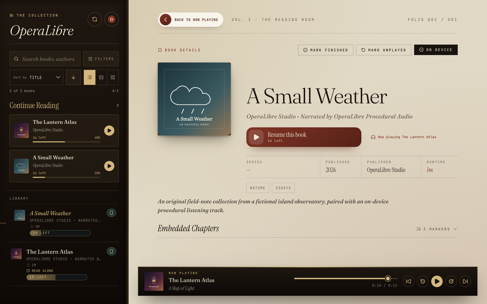
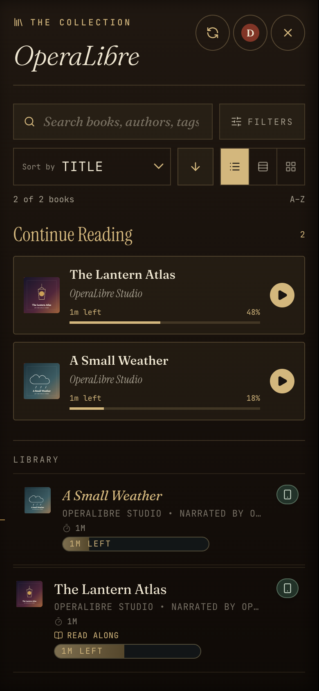

# OperaLibre

A private, self-hosted audiobook server with web, iPhone, iPad, Android, and macOS apps. Point it at a folder of audiobooks and stream them with per-reader progress, chapter navigation, readalong, and optional Audible and Libro.fm imports.

OperaLibre can also run as a headless audiobook server. The included React/Vite app is the reference frontend, while the Rust server exposes an HTTP API for custom web, mobile, desktop, or native clients.

## Install in one command

On macOS and Linux, this downloads the newest release for your computer, verifies its published SHA-256 digest, asks a few setup questions, and starts the server:

```bash
curl -fsSL https://raw.githubusercontent.com/DonovanMontoya/OperaLibre/main/script/install.sh | sh
```

Windows and manual installs are covered in [Install a Release](installing-a-release.md).

## Web, Android, iPhone, and iPad apps

<p align="center">
  
  
</p>

## Features at a glance

- **Streams almost anything** — `.mp3`, `.m4b`, `.m4a`, `.mp4`, `.aac`, `.flac`, `.ogg`, `.opus`, `.wav`, `.aiff`
- **Real seeking** — HTTP range requests, so scrubbing works on huge `.m4b` files
- **Rich metadata** — title/subtitle, author, narrator, publisher, dates, genres, custom ordered tags, language, description, and covers administrators can replace without changing audio
- **Chapters** — M4A/M4B/MP4 chapter tracks, MP3 ID3 `CHAP` frames, and multi-file track boundaries
- **Readalong** — full-window reader for `.epub`, `.pdf`, `.txt`, `.html`, `.htm` companion files, with contents and playback controls
- **Readalong sync** — EPUB chapter sync, plus sentence seeking and highlighting with an aligned map and the follow-along experiment enabled; the optional generator installs separately from Administration
- **Multi-reader** — accounts, per-reader progress, Argon2-hashed passwords
- **Player controls** — playback speed, 15s rewind, 30s skip, sleep timer, OS Media Session
- **Web and native mobile apps** — installable PWA plus Capacitor projects for Android and iPhone
- **Offline listening** — download books in the native apps, or import audio and a matching EPUB into an on-device library without a server
- **CarPlay** — browse and play your library from the car screen; downloaded books play without a network
- **Third-party clients** — a subset of the Audiobookshelf API for compatible clients, plus an OPDS catalog; see [Client compatibility](client-compatibility.md)
- **Optional Audible import** — drive a local [Libation](https://github.com/rmcrackan/Libation) install from the web UI
- **Optional Libro.fm import** — import your purchases into the server, or download them directly in the native apps
- **Try the demo** — bundled Alice audio, EPUB, and sentence timings work without a server, account, or network

## Documentation

1. [Install a Release](installing-a-release.md) — easiest setup for Windows, macOS, and Linux
2. [Getting Started](getting-started.md) — choose a setup or build from source
3. [Configuration](configuration.md) — every key in `server.config` explained
4. [Library Layout](library-layout.md) — how to structure your audiobook folder
5. [Users & Accounts](users.md) — first-run admin setup, adding readers, sessions
6. [Using OperaLibre](using-operalibre.md) — phones, reader accounts, uploads, readalong, Jellyfin, and optional imports
7. [Libation / Audible Import](libation.md) — optional acquisition pipeline
8. [API Reference](api.md) — HTTP endpoints exposed by the server
9. [Deployment](deployment.md) — running on a home server or LAN
10. [Troubleshooting](troubleshooting.md) — common problems and fixes
11. [iOS Release Changelog](ios-changelog.md) — iPhone and iPad versions and build notes
12. [Update Manifest](update-manifest.md) — how installations find and verify updates
13. [Libro.fm Import](libro.md) — server imports, watched folders, and device downloads
14. [Client compatibility](client-compatibility.md) — third-party client coverage and limitations

## Architecture

```text
┌─────────────────────┐        ┌──────────────────────────┐
│  apps/web (Vite)    │  HTTP  │  apps/server (Rust/axum) │
│  React + TypeScript │ ─────▶ │  Library scan, streaming │
│  PWA, Media Session │        │  Auth, progress, covers  │
└─────────────────────┘        └────────────┬─────────────┘
                                            │
                                            ▼
                              ┌──────────────────────────┐
                              │  library_root/           │
                              │  data/ (SQLite database) │
                              │  Libation CLI (optional) │
                              └──────────────────────────┘
```

The backend is a single Rust binary (`apps/server`). The frontend is a static React build (`apps/web`) that can be served by anything — Vite in dev, the Rust server in production, or any static host pointed at the API.

The server owns library scanning, authentication, metadata extraction, cover art, readalong files, progress sync, downloads, and byte-range audio streaming. A custom frontend can build its own browsing and playback experience on top of the API described in [API Reference](api.md).

## License

See the [PolyForm Noncommercial License](https://github.com/DonovanMontoya/OperaLibre/blob/main/LICENSE.md) in the repository.
